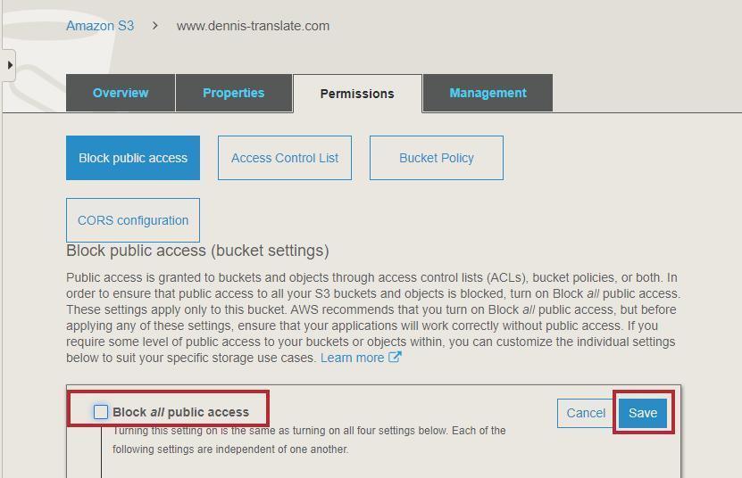
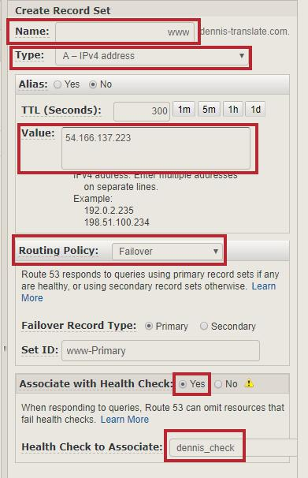
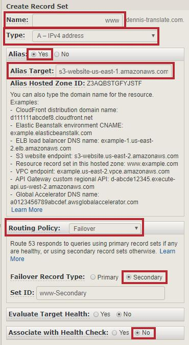

# 翻譯蒟蒻

## 應用場景


<p align="center">
    
</p>

這個Lab會教大家如何從入門到放棄學會用API Gateway、Lambda、Translate建立一支翻譯API，再透過JavaScript來call自己的API，進而創建屬於自己的翻譯網頁，以後翻譯不需要再靠Google，也不需要依靠多啦A夢的翻譯蒟蒻，翻譯蒟蒻什麼的自己做就好484。創建好網頁之後再來要思考如何架起Host這個網頁的伺服器，這邊我是使用AWS EC2搭配Linux作業系統及Apache讓大家的翻譯蒟蒻能夠被大家吃到哦。當然這樣還是太混分了，為了讓顧客能夠吃到品質更優良的翻譯蒟蒻，再使用AWS Route 53 failover功能達到EC2掛掉時也讓上網的人看到一個正常錯誤提醒網頁顯示在眼前(S3 host)，而不是直接404 Not Found，避免顧客沒吃到蒟蒻也不知道發生什麼事，給顧客更良好的用餐體驗，那我們直接開始吧。

## 在開始前...

在開始前先下載必要檔案，請點[這邊](https://github.com/dennis5581407/translate/archive/master.zip)來下載，下載完成後解壓縮就完成了，接下來開始教學。


## 教學步驟

### 創建IAM Role

這邊要創建IAM Role給Lambda使用，讓他有權限可以使用Amazon Translate。

1. 進入**AWS Console**後，點擊最上面的**Services**，選擇**IAM**。
2. 在最左邊的選單中選擇**Roles**，然後點**Create role**。

<p align="center">
    
</p>

3. 點選**AWS service** -> **Lambda** -> **Next: Permissions**

<p align="center">
    
</p>

4. 搜尋`TranslateFullAccess`的role，將它打勾，然後點選右下角的**Next: Tags** -> **Next: Review**。

<p align="center">
    
</p>

5. 在**Role name**欄位輸入`<your-name>_lambda_translate`，接著點擊右下角的**Create role**。

<p align="center">
    
</p>

### 創建Lambda Function

1. 進入**AWS Console**後，點擊最上面的**Services**，選擇**Lambda**。
2. 在最左邊的選單中選擇**Functions**，然後點**Create Function**。

<p align="center">
    
</p>

3. 選擇上方的**Author from scratch**，接著按照下面說明填上空白欄位，沒講到就代表不用動它，預設就好:

- Function name : `<your-name>_translate`
- Runtime : `Python 3.7`

<p align="center">
    
</p>

4. 展開**Choose or create an execution role**，接著點**Use an existing role**，選擇`<your-name>_lambda_translate`，就是妳剛剛創的role。

<p align="center">
    
</p>


5. 點右下角的**Create function**。

6. 接著複製下面的程式碼，貼上Lambda內的coding區:
```bash
import boto3
import json

translate = boto3.client('translate')

def lambda_handler(event, context):

    try:
        response = translate.translate_text(
            Text=event['content'],
            SourceLanguageCode=event['source-lanuage'],
            TargetLanguageCode=event['target-lanuage']
        )
        print(response['TranslatedText'])
        return {
            'statusCode': 200,
            'body': response['TranslatedText']
        }
        
    except:
        return {
            'statusCode': 400,
            'body': '打個字好ㄇ'
        }
```

<p align="center">
    
</p>

7. 點擊右上角的**Save**。

### 創建API

在這邊會使用API Gateway來把剛剛寫的Lambda Function變成API產生URL，讓我們可以用JavaScript去Call它。

1. 進入**AWS Console**後，點擊最上面的**Services**，選擇**API Gateway**。
2. 在最左邊的選單中選擇**APIs**，然後點擊**Create API**。

<p align="center">
    
</p>

3. 在**API name**欄位輸入`<your-name>_translate_api`，其他皆預設，接著點擊**Create API**。

<p align="center">
    
</p>

4. 點擊**Actions** -> **Create Method**。

<p align="center">
    
</p>

5. 選擇`POST` method，再點旁邊的小勾勾確定，這邊的意思是call這API時要用什麼method才能夠call。

<p align="center">
    
</p>

6. 在**Lambda Function**欄位輸入`<your-name>_translate`，也就是剛剛創的Lambda Function的名字，接著點擊**Save**，跳出來的對話框直接點**OK**

<p align="center">
    
</p>

7. 接著啟用CORS，點擊**Actions** -> **Enable CORS**。

>關於CORS（跨來源資源共用）的意思是某個網域想要取用不同網域的資源時會被瀏覽器擋下來，因此要特別去允許別的網域存取，更詳細的說明可以上網Google。
<p align="center">
    
</p>

8. 點擊**Enable CORS and replace existing CORS headers**後，跳出的對話框再點**Yes, replace existing values**。

<p align="center">
    
</p>

9. 點擊**Actions** -> **Deploy API**。

<p align="center">
    
</p>

10. 照著下列資訊填入欄位，接著點擊**Deploy**。

- Deployment stage : `[New Stage]`
- Stage name : `test`

<p align="center">
    
</p>

1.  Deploy完API後，點擊 **Stages** -> **test**，右手邊會看到**Invoke URL**，把那個URL複製起來，想要call API用那個URL就對了。

<p align="center">
    
</p>

12. 接著要編輯我們的翻譯蒟蒻網頁，也就是在開始前下載的資料夾，裡面有`index.html`的檔案，將其編輯，並依照下面說明來將你自己的API URL貼上去:

```bash
var SourceLang = document.getElementById('select_source_lang');
var SourceLangSelected = SourceLang.options[SourceLang.selectedIndex].value;
var translate_data = document.getElementById('translate_source').value

var TargetLang = document.getElementById('select_target_lang');
var TargetLangSelected = TargetLang.options[TargetLang.selectedIndex].value;

var url = '這裡貼上你的API URL';
var data = {
    "content": translate_data,
    "source-lanuage": SourceLangSelected,
    "target-lanuage": TargetLangSelected
}
```

<p align="center">
    
</p>

13. 接著可以直接打開`index.html`做測試，選擇你想要翻譯的語言，並在上方空格處輸入句子，點擊**翻譯**，在下方空格處會顯示出翻譯結果，若正常運行就代表你成功了！
> 注意:此API URL先記著，在架Web Server的時候還會用到。
<p align="center">
    
</p>

### 創建EC2 Instance

在這之前已經完成一個段落了，成功創建出翻譯網頁，接下來的步驟會教各位如何將翻譯網頁架在伺服器上，讓人人都可以享用翻譯蒟蒻，那我們直接開始吧。

1. 進入**AWS Console**後，點擊最上面的**Services**，選擇**EC2**。
2. 在最左邊的選單中選擇**Instances**，然後點擊**Launch Instance**。

<p align="center">
    
</p>

3. 作業系統選擇**Amazon Linux AMI 2018.03.0(HVM)**，點擊**Select**。
>注意不要選到**Amazon Linux 2 AMI**唷，兩者不太一樣。

<p align="center">
    
</p>

4. **Instance Type**使用**t2.micro**，接著點擊**Next: Configure Instance Details**。

<p align="center">
    
</p>

5. 直接點擊**Next: Add Storage** -> **Next: Add Tags**，在這邊我們為自己的Instance命名，點擊**Add Tag**，依照下列資訊填入資料:

-  Key : `Name`
-  Value : `<your-name>_translate_server`
-  填完後點擊**Next: Configure Security Group**

<p align="center">
    
</p>


6. **Security Group**是用來決定等等你開的server可以被誰、被什麼Protocol連進去，在這邊我們直接點擊**Add Rule**來新增兩個規則:

- HTTP規則：讓大家都可以透過HTTP連進server，也就是可以透過瀏覽器連進來。
  - Type : `HTTP`
  - Source : `Anywhere`
  
- SSH規則：讓管理員能夠透過command line的方式操作這台Server，就是遠端連線的cmd版本的感覺。
  - Type : `SSH`
  - Source : `Anywhere`

7. 設完連進Server的規則之後點擊**Review and Launch**。
    
<p align="center">
    
</p>

8. 最後是讓你確認一下設定有沒有設錯，確定都正常後點擊**Launch**。

9. 接著會跳出選擇私鑰的視窗，因為要用SSH連進自己的Server時需要做驗證，私鑰的存在也是為了安全性，如果沒有私鑰，Security Group那邊SSH的Source又設Anywhere的話，意思是只要有IP就可以直接操作你的Server，這是非常危險的事，總之這邊照著下列說明設定:

- 選擇`Create a new key pair`
- 在**Key pair name**欄位輸入`<your-name>_key`
- 點擊**Download Key Pair**
- 點擊**Launch Instances**

> 下載下來的私鑰千萬不能弄丟，弄丟就回不來了，也不要隨便交給別人。
<p align="center">
    
</p>

10. 創建完成後點擊**View Instance**。

### 使用PuTTY連進自己的Instance

在這邊會教各位如何使用**PuTTY**走SSH Port連進自己的Instance，但在連進去之前，由於剛剛下載下來的私鑰副檔名是.pem，但**PuTTY**的金鑰認證要使用.ppk檔，因此我們需要用**PuTTYgen**來把.pem檔轉成.ppk檔。

在開始前請先下載[PuTTY](https://the.earth.li/~sgtatham/putty/latest/w64/putty.exe)及[PuTTYgen](https://the.earth.li/~sgtatham/putty/latest/w64/puttygen.exe)。

1. 首先先把.pem的私鑰檔轉檔成.ppk，打開**puttygen**，點擊**Load**選擇剛剛下載下來的私鑰，接著點擊**Generate**產生.ppk私鑰，最後點擊**Save private key**將.ppk私鑰儲存起來。

<p align="center">
    
</p>

2. 這時先回到剛剛EC2的介面，把你instance的**Public DNS**或**IPv4 Public IP**複製起來。

<p align="center">
    
</p>

3. 準備連進你的Instance，打開**PuTTY**，將你instance的IP貼上**Host Name**的欄位。

<p align="center">
    
</p>

4. 接下來要匯入私鑰，展開左手邊的**SSH**，點擊**Auth**，點擊**Browse**匯入剛剛轉檔完成的.ppk私鑰。

<p align="center">
    
</p>

5. 點擊**Open**，開始連接。

6. 第一次連線時會跳出Security Alert的對話框，直接點擊**是**。

7. 成功連線後會要你輸入以什麼身分登入，這邊輸入`ec2-user`，按下**Enter**，就成功連線了。

<p align="center">
    
</p>

### 將翻譯蒟蒻佈署到Web Server上

1. 首先我們先更新內建的套件:

```bash
$ sudo yum update -y
```
> 後面的參數-y代表的是只要碰到回答yes or no的安裝會自動幫我們回答yes。

2. 安裝Apache Web Server:

```bash
$ sudo yum install -y httpd24
```

3. 啟動Apache Web Server:

```bash
$ sudo service httpd start
Starting httpd:                                            [  OK  ]
```

4. 使用 chkconfig 命令來設定 Apache Web 伺服器在每次系統開機時啟動。

```bash
$ sudo chkconfig httpd on
```
當成功使用 chkconfig 命令啟用服務時，它不會提供任何確認訊息。

要確認 httpd 已啟用，您可以執行以下命令：
```bash
$ chkconfig --list httpd
httpd           0:off   1:off   2:on    3:on    4:on    5:on    6:off
```
此處，在執行層級 2、3、4、5 的 httpd 為 on (這樣就代表有成功啟用)。

5. 此時Web Server已經正式啟用，可以用瀏覽器連進你instance的ip測試看看，是否跟下面圖片看到的畫面一樣。

<p align="center">
    
</p>

6. 接著要將我們的翻譯蒟蒻正式佈署到Web Server上，首先先把翻譯網頁下載到你的instance裡:

```bash
# 安裝git套件，因為我把翻譯網頁上傳到github上，因此要使用git套件下載下來
$ sudo yum install git-all -y

# 下載翻譯網頁
$ git clone https://github.com/dennis5581407/translate.git
```

7. 這時翻譯網頁已經成功下載到你的instance裡，現在要修改code裡的API URL，將它改成你自己的，就是前面操作API Gateway得到的那串URL，接下來打的Linux指令都是最基本的，希望你們可以學起來。

```bash
# 確認當前目錄底下是否有translate的資料夾存在，使用ls(list)指令
$ ls

# 若有的話進入那個資料夾內，使用cd(change directory)指令
$ cd translate

# 再確認一次當前目錄底下是否有index.html的檔案存在，使用ls(list)指令
$ ls

# 有的話使用vim來編輯index.html這檔案，vim為linux常見的編輯器，還有nano也很常見。
$ vim index.html
```

這邊補充vim的操作方法，首先它有分兩種模式，一種是指令模式，一種是編輯模式。在指令模式下無法編輯文件內容，但要儲存檔案或離開檔案都是在指令模式下達成；在編輯模式下能夠正常的編輯文件內容。剛使用vim進入文件時，都是處於指令模式，這時按下`i`，進入編輯模式；按下`esc`離開編輯模式、回到指令模式。編輯完以後在指令模式輸入`:wq`可以存檔離開文件，這時就完成最基本的編輯了。

更詳細的vim操作教學可以參考鳥哥的網站 : http://linux.vbird.org/linux_basic/0310vi.php

<p align="center">
    
</p>

8. 在**index.html**添加完自己的API URL後，將它移到`/var/www/html`的路徑內，用瀏覽器連進Web Server後會顯示什麼網頁就取決於這路徑內所存放的html檔。

```bash
$ sudo mv index.html /var/www/html
```

9. 接下來再用瀏覽器連進自己的instance IP來做測試，如果成功顯示翻譯網頁就代表大功告成了！

### 在S3上Host網頁

接下來我們要用Route 53來實現failover，failover的意思是當原本主要的網頁掛掉後，它會將Domain Name自動引導到次要網頁，在此之前我們要用S3來Host次要網頁。

1. 進入**AWS Console**後，點擊最上面的**Services**，選擇**S3**。
2. 點擊**Create bucket**。

<p align="center">
    
</p>

3. 在**Bucket name**欄位輸入`www.<your-name>-translate.com`，然後點擊**Create**。
> Ex: `www.dennis-translate.com` 注意這邊一定要照著填，否則後面程序會有錯

<p align="center">
    
</p>

4. 點擊進入自己的bucket。

<p align="center">
    
</p>

創完網頁後，接下來開啟**Static website hosting**功能，也就是用S3 host靜態網頁的功能。

5. 點擊上方的**Properties**，再點擊**Static website hosting**。

<p align="center">
    
</p>

6. 選擇**Use this bucket to host a website**，接著再**Index document**欄位輸入`index.html`，最後點擊**Save**。

<p align="center">
    
</p>

接著要開啟讓所有人都可以Read s3 bucket內東西的權限，預設是拒絕所有人Read。

7. 點擊上方的**Permissions**，再點擊**Block public access** -> **Edit**。

<p align="center">
    
</p>

8. 將**Block all public access**取消打勾，之後點擊**Save**，對跳出的視窗輸入`confirm`，之後點擊**Confirm**。

<p align="center">
    
</p>

啟動完**Static website hosting**功能、開啟對外權限後，上傳自己的翻譯網頁至S3 bucket內。

1. 點擊上方的**Overview**，再點擊**Upload**。

<p align="center">
    
</p>

8. 點擊**Add files**，選擇自己的翻譯網頁`index.html`，之後點擊**Next**。
   
9. 滑到最下面，在**Manage public permissions**中，選擇`Grant public read access to this object(s)`，之後點擊**Upload**。

<p align="center">
    
</p>

10. 接下來網站已經給S3 host了，來測試看看有沒有正常運作，點擊**Properties** -> **Static website hosting**，點擊上方**Endpoint**的網址，進去後有正常看到翻譯網頁就代表成功了。

<p align="center">
    
</p>

### 使用Route 53的failover功能

接下來要使用Route 53的failover功能，我們通常會把EC2 Server當作Primary，S3 Host的網頁當作Secondary，當Primary的伺服器掛掉後，Route 53會自動將Domain Name導向Secondary。但在這個教學中，由於申請Domain Name需要不少錢，所以會用假的Domain Name，只會形式上的做步驟，不會有實際的功能，這點還請大家包容，那我們開始吧。

1. 進入**AWS Console**後，點擊最上面的**Services**，選擇**Route 53**。
2. 在最左邊的選單中選擇**Health checks**，然後點擊**Create health check**。

在這邊建立health check，health check會一直不斷檢測輸入的網址是否健康，要價不斐，下課時記得關掉。

<p align="center">
    
</p>

3. 照著下面資料填入欄位，填完後點擊**Next** :

- Name : `<your-name>_check`
- IP address : `填入你的EC2 Instance的Public IP address`
- Path : `index.html`

<p align="center">
    
</p>

4. 創建完大約過4分鐘後，會看到它的**Status**為**Healthy**，若不是顯示**Healthy**的話，就代表設定有錯。

<p align="center">
    
</p>

接下來要創立管理自己Domain Name的Hosted zones，但在這邊我們用個範例的Domain Name就好，畢竟真正的Domain Name要錢，有興趣的同學可以去[GoDaddy](https://tw.godaddy.com/)之類的網站購買。
>這不是業配
5. 在最左邊的選單中選擇**Hosted zones**，然後點擊**Create Hosted Zone**。

<p align="center">
    
</p>

6.  在**Domain Name**的欄位填入`<your-name>-translate.com`，接著點擊**Create**。
   
<p align="center">
    
</p>

7. 接著點擊**Create Record Set**。

<p align="center">
    
</p>

8. 照著下列資料填入欄位，接著點擊**Create**。

- Name : `www`
- Type : `A - IPv4 address`
- Value : `你的EC2 Instance Public IP address`
- Routing Policy : `Failover`
- Associate with Health Check : `Yes`
- Health Check to Associate : `<your-name>_check` 就是你剛剛創的health check
  
<p align="center">
    
</p>

9. 再點擊一次**Create Record Set**，照著下列資料填入欄位，接著點擊**Create**。

- Name : `www`
- Type : `A - IPv4 address`
- Alias : `Yes`
- Alias Target : `www.<your-name>-translate.com` 就是剛剛在s3創立的bucket name
- Routing Policy : `Failover`
- Failover Record Type : `Secondary`
- Associate with Health Check : `No`

<p align="center">
    
</p>

這樣就完成所有的步驟了，由於我們用的是範例Domain Name，並不是真正買下來的，所以沒辦法做測試，總之就是當Primary的IP位址掛掉的話，Route 53就會自動將Domain Name引導至Secondary的位址，也就是s3 host website的網址，藉此達到伺服器掛掉也不怕太難看的功用。

## 清理資源

有些資源放著會一直跳錢，往負跳的那種，所以做完Lab時要養成清理資源的好習慣。

- EC2 Instance
- Lambda Funtion
- API Gateway
- S3 Bucket
- Route 53 Health Check、Hosted Zone
